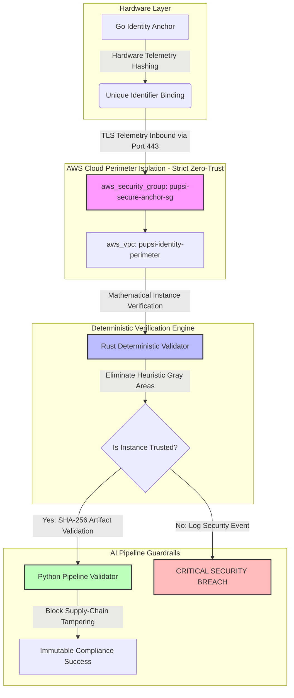

# ⚡ Studio PUPSI: Next-Gen Platform Engineering & Cloud-Native Security

### **Automated Infrastructures | DevSecOps (IaC) | Deterministic AI-Pipeline Security**

---

### **Executive Summary**
This ecosystem, engineered by **Studio PUPSI**, delivers high-performance platform architectures and decentralized security modules. By replacing vulnerable behavioral heuristics with a **Hardware Root of Trust (TPM 2.0)**, we enforce immutable software identity and automated compliance across cloud-native environments and AI development pipelines.

It is designed for mission-critical enterprise infrastructures, secure edge computing, and high-stakes cloud environments where automated integrity verification is non-negotiable.


##########################################################################################################


### **🛠️ Tech Stack & Ecosystem**

*   **Languages:** `Rust` | `Go` | `C# (.NET Core)` | `Modern JavaScript (ES6+)` | `Modern C++`
*   **Web & Data:** `HTML5` | `CSS3` | `SQL (Structured Query Language)` | `Protocol Buffers`
*   **Hardware Trust:** `TPM 2.0 (TSS/TCG Specifications)` | `Secure Storage API`
*   **Cryptography:** `ED25519` | `SHA-256` | `Zero-Knowledge Handshakes`
*   **Networking & Architecture:** `IPv6-Native` | `gRPC` | `Service Mesh Integration`
*   **DevOps & Security:** `Docker` | `eBPF Kernel Telemetry` | `GitHub Actions (CI/CD)`

---

### **🛡️ Verified Credentials & Certifications**
My architectural designs, security frameworks, and engineering skills are backed by industry-standard, globally verifiable digital credentials.

*   **Mimo Professional Track (Full-Stack, AI & Systems Engineering)**
    *   *Core Competencies:* Backend API Architecture (Node.js/Express), Python AI Development (LLM integration, automated scripts), Modern UI Engineering (React/HTML5/CSS3), SQL Database Design, and Advanced Data Structures & Algorithms.
    *   *Verification 1 (Python AI):* **[Verify via VirtualBadge](https://virtualbadge.io)** (ID: `cf284e71-3dec...`)
    *   *Verification 2 (Full-Stack):* **[Verify via VirtualBadge](https://virtualbadge.io)** (ID: `1ae00a5c-eb93...`)
    *   *Verification 3 (Back-End):* **[Verify via VirtualBadge](https://virtualbadge.io)** (ID: `760fa170-3058...`)
    *   *Verification 4 (Front-End):* **[Verify via VirtualBadge](https://virtualbadge.io)** (ID: `9dbcf8ff-fdf9...`)

*   **Cloud Architecture & Security (Credly Ecosystem)**
    *   *Core Competencies:* IAM (Identity & Access Management), Automated Compliance, Secure Edge Infrastructure.
    *   *Verification:* **[Verify on Felix Schilling's Credly Profile](https://credly.com)**.

---
**Author:** Felix Schilling  
**Focus:** IAM | Cloud Security Architecture | Full-Stack Automation | AI Systems
--------------------------------------------------------------------------------------------------------------------------

*   **System- & Automatisierungs-Ebene (Python / C# / Rust):** Du baust die harte Logik direkt auf der Hardware (TPM 2.0).
*   **Infrastruktur- & Cloud-Ebene (Credly / AWS / Azure / Cisco):** Du betest die Security-Mechanismen in globale Cloud-Architekturen ein.
*   **Schnittstellen-Ebene (Mimo Track):** Du lieferst die APIs, Datenbanken und Dashboards, um das Gesamtsystem zu steuern.
---------------------------------------------------------------------------------------------------------------------------


### **Executive Summary**
This module provides a **deterministic identity framework** for decentralized applications. Instead of relying on vulnerable behavioral heuristics or easily spoofed software tokens, this system establishes a **Hardware Root of Trust** to validate software instances.

It is designed for high-stakes environments (e.g., multiplayer backends, secure edge computing) where verifying the **integrity of the client** is mission-critical.

---

### **Core Engineering Principles**

#### **1. Deterministic over Heuristic**
We explicitly reject AI-based behavioral analysis for security validation. AI introduces ambiguity and "false positives." Our approach is binary: a software instance is either **valid and unmodified**, or it is denied access.

#### **2. Hardware-Bound Identity**
Identity is anchored to the physical host using:
*   **Cryptographic Binding:** Utilizing TPM 2.0 (or OS-level secure storage) to store instance-specific keys.
*   **Unique Hardware Fingerprinting:** Generating a stable Software-ID derived from immutable hardware identifiers (CPU/Mainboard UUIDs).

#### **3. Remote Attestation (Zero-Knowledge Style)**
The system performs a challenge-response handshake that proves the instance's identity and binary integrity without transmitting sensitive raw hardware data over the network.

---

### **Key Features**
*   **IPv6-Native:** Built for modern, NAT-less networking environments.
*   **Anti-Cloning:** Prevents "Identity Injection" by binding the software license to the specific machine instance.
*   **Lean Execution:** Minimal CPU/RAM overhead compared to resource-heavy security agents or ML models.

---

### **Technical Implementation (Logic Flow)**
1. **Provisioning:** On first run, the module generates a unique ED25519 keypair.
2. **Binding:** The public key is hashed with hardware-specific telemetry to create the `Software-ID`.
3. **Verification:** The server sends a random nonce; the client signs it using the hardware-bound private key.
4. **Integrity Check:** A SHA-256 hash of the executing binary is included in the handshake to detect unauthorized modifications.

---

### **Future Roadmap (Project PUPSI Integration)**
This module serves as the foundational security layer for **Project PUPSI**, ensuring that only authorized, unmodified game instances can participate in the global service mesh.

---
**Author:** Felix Schilling  
**Focus:** IAM, Cloud Security Architecture, Automation.


## 🏗️ System Architecture & Zero-Trust Perimeter




------------------------------------------------------------------------------------------------------------------
## Example SNIPLETS:

## 💻 Core Implementation Modules

The technical core of the deterministic identity framework is decoupled into specialized, high-performance layers:

* **[Infrastructure as Code (IaC)](./iac/network_security.tf):** Production-ready Terraform blueprint demonstrating micro-segmentation and strict stateful boundary isolation (AWS VPC).
  
* **[Deterministic Validator (Rust)](./src/security/verifier.rs):** Mathematical instance verification eliminating heuristic gray areas.
  
* **[Hardware Identity Anchor (Go)](./src/hardware/identity.go):** Multiplatform hardware telemetry hashing and unique identifier binding.
  
* **[AI Pipeline Guardrails (Python)](./src/ai-pipeline/pipeline_validator.py):** Deterministic SHA-256 artifact validation to block supply-chain tampering.
  


```


